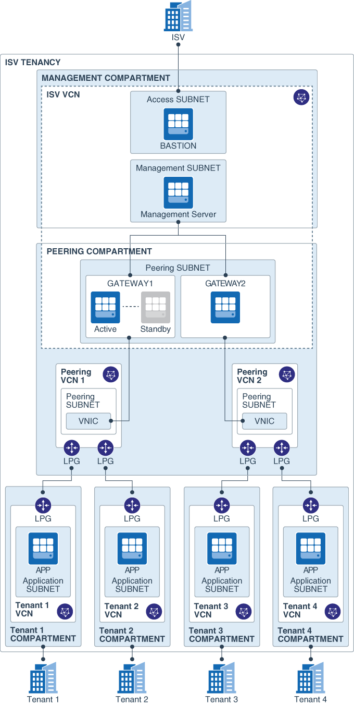

ISV Single-Tenant VCN Isolation solution
========================================

This solution provides a network architecture that isolates an ISV's customers in separate VCNs in a single OCI tenancy. It includes a central management network through which the ISV can connect to and manage all the customer environments.

## Terminology

* **SaaS ISV**: An independent software vendor that provides software as a service.
* **Tenancy**: An Oracle Cloud Infrastructure account, owned by an ISV.
* **Tenant**: A customer of the ISV.

## Architecture

The following diagram shows the target topology:



### Management Layer
This layer in the topology includes the following resources:
-  **Bastion server**:	This server is deployed in a public subnet. It is used by the Terraform script to provision applications on the tenant VCNs. It can also be used to access resources in private subnets in the management VCN and the tenant VCNs.
-  **Monitoring server**: This is used to monitor all the applications deployed across the tenant VCNs.  A Nagios Management server can be installed as a monitoring example, see instructions below.
-  **Gateway cluster**: The gateway is deployed with a Pacemaker/Corosync cluster. The cluster includes multiple virtual routers to provide high availability when there are issues with the configuration or the OS. The cluster uses a secondary IP address, which can *float* between two virtual routers. This enables high availability with minimal to zero downtime.

### Peering Network
The VCNs in this network serve as a bridge between the single management network and multiple tenant networks. A combination of local peering gateways (LPG) and VNIC attachments enables you to scale up the architecture. Each host in the gateway cluster has a secondary VNIC in the peering network VCNs, which, in turn, are peered through an LPG with the individual tenant VCNs. The instance shape of the gateway hosts dictates the maximum number of secondary VNICs that the architecture can support.

### Tenant Layer
This layer contains the following resources:
- **Tenant VCNs**: Each tenant (that is, the end customer of the ISV) is isolated in a separate VCN with no connectivity between the tenants. Each tenant VCN has backward connectivity to the ISV's management network.
- **Tenant server**: A Nagios Remote Plugin Executor (NRPE) can be installed on a server in each tenant VCN, see instructions below. The NRPE reports the health of the server to the Nagios monitoring server in the management layer. This installation is solely for the purpose of demonstrating the direct connectivity from the management network to the tenant networks with a scale-out architecture.


## Quickstart Deployment

1. Clone this repository to your local host. The `examples` directory contains the Terraform configurations for a sample topology based on the architecture described earlier.

2. Install Terraform. See https://learn.hashicorp.com/terraform/getting-started/install.html.

3. Open `examples/full-deployment/terraform.tfvars` in a plain-text editor, and enter the values of the variables in that file.

4. Set the deployment passwords and shared secrets.  The full deployment examples requires variables to be set for the shared secret for the routing HA cluster. This can be set using environment variables, or added to the `terraform.tfvars` files in the `full-deployment/peering/routing` configuration directory. e.g.

	```
	$ export TF_VAR_hacluster_password="P@55_Word"
	```

5. Deploy the topology:

You can deploy the entire topology with a single command by using [Terragrunt](https://github.com/gruntwork-io/terragrunt). Alternatively, deploy the configuration in each subdirectory using Terraform.

*(placeholder: explain the value of deploying using Terraform, considering that Terragrunt provides a simpler flow)*

-   **Deploy Using Terraform**

	1. Copy the `examples/full-deployment/terraform.tfvars` into each Terraform configuration sub directory.
	2. Go to the `full-deployment/common/configuration` directory.
	3. Run the following commands:
    	```
    	terraform init
    	terraform plan
    	terraform apply
    	```
	4. Repeat runing the `terraform init`, `terraform plan`, and `terraform apply` commands in the following directories, in the given order:
		- `examples/full-deployment/common/compartments`
    	- `examples/full-deployment/peering/network`
    	- `examples/full-deployment/management/network`
    	- `examples/full-deployment/tenant/network`
    	- `examples/full-deployment/management/access`
    	- `examples/full-deployment/peering/routing`
    	- `examples/full-deployment/management/servers`
    	- `examples/full-deployment/management/server_attachment`
    	- `examples/full-deployment/tenant/servers`


-   **Deploy Using Terragrunt**

	1. Install Terragrunt. See https://github.com/gruntwork-io/terragrunt#install-terragrunt.
	2. Go to the `examples/full-deployment` directory, and run the following commands:

	    ```
    	make init
	    terragrunt apply-all
	    ```

		All the resources defined in the configuration are deployed.

	3. (Optional) To remove all the resources, run the following command:
	    ```
	    terragrunt destroy-all
	    ```

## Test the Sample Topology

Automated tests are provided in the `test` directory. See [`test/README`](test/README.md).

The whole setup once deployed can be tested thru either executing the tests and/or viewing the Nagios management host url.  See Nagios example installation below.

Once logged in with the credentials then the user can navigate to the Nagios management portal and verify that all the provisioned tenant servers can be seen and in healthy state.

## Troubleshooting

### Cleaning up a after a failed or partial deployment

If the full deployment of the solution fails due to an error and you want to un-deploy the partially provisioned configuration using the `terragrunt destroy-all` option can return an error like:

```
Error: Unsupported attribute

  on management_rte_attachment.tf line 8, in module "management_rte_attachement":
   8:     data.terraform_remote_state.peering_servers.outputs.routing_instance_1_ip_id,
    |----------------
    | data.terraform_remote_state.peering_servers.outputs is object with 3 attributes

This object does not have an attribute named "routing_instance_1_ip_id".
```

If this occurs you will need to manually run `terraform destroy` in each terraform configuration directory in the reverse order of the folders listed in the **Deploy Using Terraform** section above.

## Solutions Overview

This solution is logically partitioned in 3 networks such as Management, Peering & Tenant network to showcase the architecture demonstration of single tenant application deployment in multitenant environment.

### Network setup

1. **Management Network**
	This partition helps give a single pane of window to manage the access, deployment & maintenance of the complete architecture

	1.1 **Bastion**
	This server helps in connecting to other resources in ISV tenancy
	-	Oracle Linux 7 image deployed in public subnet
	-	only point of ingress to resources in ISV tenancy from Internet
	-	`ssh -i keypair.pem opc@bastion_ip`

	1.2 ****Management Server**** 
	The monitoring s/w Nagios can be installed on it and configured to listen to all the server's deployed in each tenant VCN's.
	-	Oracle Linux 7 image deployed in private subnet
	-	Nagios (v 4.3.4) installation instructions below.
	-	configured with IP addresses of all the server's deployed in different tenant VCN's.
	-	upon deployment the Nagios monitoring application can be accessed thru bastion tunnel 		
	-	tunneling --	`ssh -L 80:management_host_ip:80 -i bastion_key.pem opc@bastion_host_ip` 
	-	access thru browser -- `http://localhost/nagios`
	-	credentials			-- 
	-	`user_id	--	nagiosadmin`
	-	`password 	--	[token set thru export TF_VAR_nagios_administrator_password]`


	1.3 **Routing Server's**
	These servers meant to act as a bridge between ISV vcn and the tenant VCN by routing traffic.
	-	Oracle Linux 7 image deployed in private subnet
	-	Pacemaker/Corosync is installed on these servers for high availability across 2 server's deployed which can be used to demonstrate failover
	-	secondary vnic deployed in peering vcn to establish connectivity over LPG with tenant VCN's
	-	secondary_vnic_all_configure.sh script is used to attach secondary vnic to persist vnic attachment `/etc/sysconfig/network-scripts/ifcfg-ens5` file is created
	-	routes to tenant vcn's are setup on this server
	-	to persist routes across reboots `/etc/sysconfig/network-scripts/route-ens5` file is created
	-	number of secondary vnics creation allowed is based on the shape of the instance [higher the shape is greater number of secondary vnics allowed]

2. **Peering Network**
This partition provides a bridging mechanism in the form of secondary vnic's made available to routing servers in management network for the purpose of achieving fan-out architecture for peering the VCN's.

	2.1 **Secondary VNIC's**
	-	LPG is created in this vcn for peering with 10 different tenant vcn's.
	-	cidr block of this VCN can be correlated to the number of vnic's that is required to be created by the routing server in the peering subnet of the ISV vcn.
	
3. **Tenant Network**
	This partition has tenant resources to demonstrate the end-to-end connectivity of the architecture.

	3.1 **Tenant Network** (1-n) [ VCN's, Subnet, IGW, NAT, LPG ]

	3.2 **Tenant Servers** (1-n) [NRPE agent can be installed and configured with Nagios server IP address to send monitorong metrics to]
	-	Oracle Linux 7 image deployed in private subnet
	-	NRPE (Nagios remote agent) can be deployed on this server and it listens on port 5666.  See instructions below
	-   NRPE configuration is updated with the IP address of the Nagios management server deployed in the management subnet of the ISV vcn.


## Routing Instance Configuration 

1. Enable IP forwarding in the kernel and ensure configuration is persistent upon reboots on both router intenance by adding the following to `/etc/sysctl.d/98-ip-forward.conf`

	```
	net.ipv4.ip_forward=1
	```

2. Attach secondary vnics with skip source/destination checked. To ensure  the vNIC attachement is maintained after reboot create a configuration file for each vNIC e.g

	e.g. `/etc/sysconfig/network-scripts/ifcfg-ens5` on Router 1

	```
	DEVICE=ens5
	BOOTPROTO=static
	IPADDR=10.253.0.2
	NETMASK=255.255.255.248
	ONBOOT=yes
	```

	e.g. `/etc/sysconfig/network-scripts/ifcfg-ens5` on Router 2

	```
	DEVICE=ens5
	BOOTPROTO=static
	IPADDR=10.253.0.10
	NETMASK=255.255.255.248
	ONBOOT=yes
	```
3. add static routes for the each Tenant VCN accessable via the routing instance pointing to the default gateway of the peering subnet the Tenant VCN is peered with

	Router 1 configuration

	```
	sudo ip route add 10.1.0.0/16 via 10.253.0.1 dev ens5
	sudo ip route add 10.2.0.0/16 via 10.253.0.1 dev ens5
	```

	Router 2 configuration

	```
	sudo ip route add 10.3.0.0/16 via 10.253.0.9 dev ens5
	sudo ip route add 10.4.0.0/16 via 10.253.0.9 dev ens5
	```


4. Persist attached routes upon reboot creating file for each vnic

	e.g. `/etc/sysconfig/network-scripts/route-ens5` on Router 1

	```
	10.1.0.0/16 via 10.253.0.1
	10.2.0.0/16 via 10.253.0.1
	```

	e.g. `/etc/sysconfig/network-scripts/route-ens5` on Router 2

	```
	10.3.0.0/16 via 10.253.0.9
	10.4.0.0/16 via 10.253.0.9
	```
## Nagios Server Sample Installation


Connect to the management server with ssh as user opc and execute the following commands:

```
1.  Install Apache:
   sudo yum install httpd
2.  Install Nagios from default repository:
   sudo yum install nagios nagios-common nagios-plugins-all
3.  Set admin password for user nagiosadmin (use these credentials to login on Nagios Web UI):
   sudo htpasswd -c /etc/nagios/passwd nagiosadmin
4.  Setup default html page for nagios testing:
   echo "<html>This is a placeholder for the home page.</html>"| sudo ssh /var/www/html/index.html
5.  Enable httpd service:
   sudo systemctl start httpd
   sudo systemctl enable httpd
6.  Enable nagios service:
   sudo systemctl start nagios
   sudo systemctl enable nagios
7.  Configure firewall:
   sudo firewall-cmd --zone=public --add-port=80/tcp --permanent
   sudo firewall-cmd --reload
8.  Define hosts configuration file:
   sudo sed -i "s@#cfg_dir=/etc/nagios/servers@cfg_dir=/etc/nagios/servers@" /etc/nagios/nagios.cfg
   sudo mkdir /etc/nagios/servers
   sudo chmod 0755 /etc/nagios/servers
   sudo touch /etc/nagios/hosts.cfg
   sudo chmod 0755 /etc/nagios/hosts.cfg
   sudo vi /etc/nagios/servers/hosts.cfg
9.  Paste the following into hosts.cfg making sure the ip addresses match the respective tenant appserver

	        define host{	
		        use linux-server
		        host_name appserver1
		        alias appserver1
		        address 10.1.1.2
		        }
	        define host{	
		        use linux-server
		        host_name appserver2
		        alias appserver2
		        address 10.2.1.2
		        }
	        define host{	
		        use linux-server
		        host_name appserver3
		        alias appserver3
		        address 10.3.1.2
		        }
	        define host{	
	   	        use linux-server
		        host_name appserver4
		        alias appserver4
		        address 10.4.1.2
		        }

10.  Restart nagios service:
   sudo systemctl restart nagios.service    
```

## Nagios Remote Plugin Executor (NRPE) Sample Installation

Connect to each of the tenant servers with ssh as user opc and execute the following commands:

	1. sudo yum install nagios nagios-plugins-all nrpe
	2. sudo firewall-cmd --zone=public --permanent --add-port=5666/tcp
	3. Execute the following command making sure the IP address matches the management server's
	        sudo sed -i "s/.*allowed_hosts=.*/allowed_hosts=10.254.100.2/" /etc/nagios/nrpe.cfg
    4. sudo systemctl start nrpe.service

